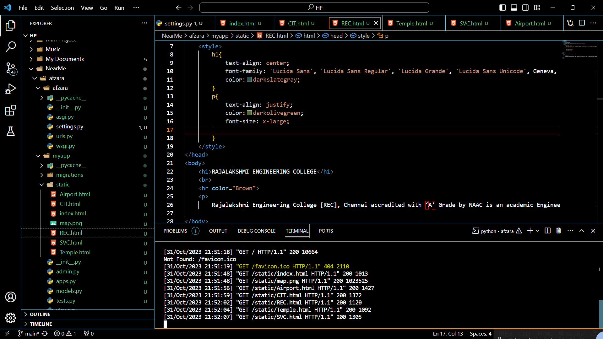
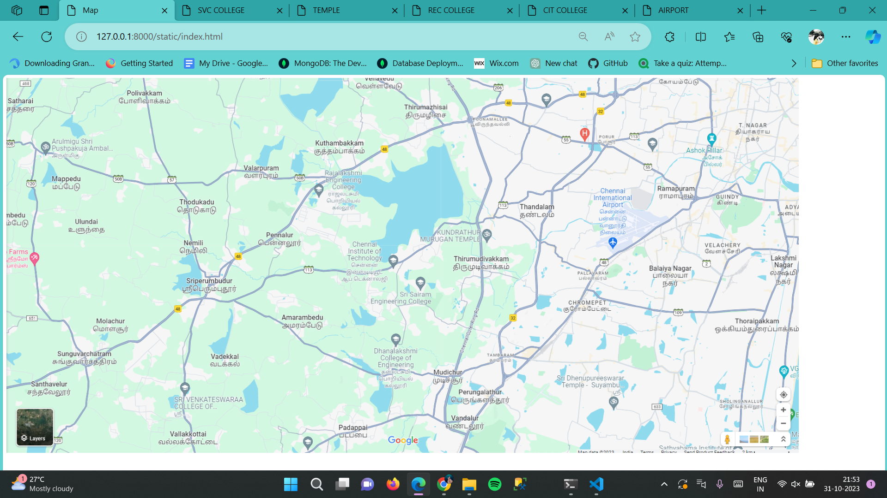
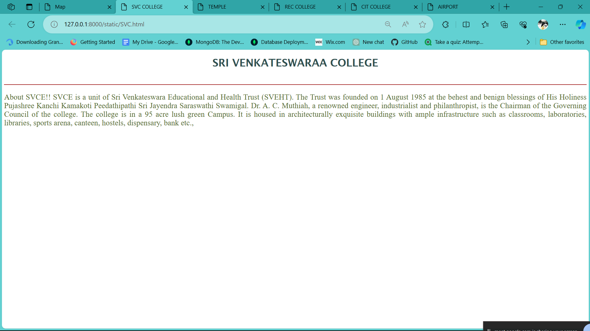
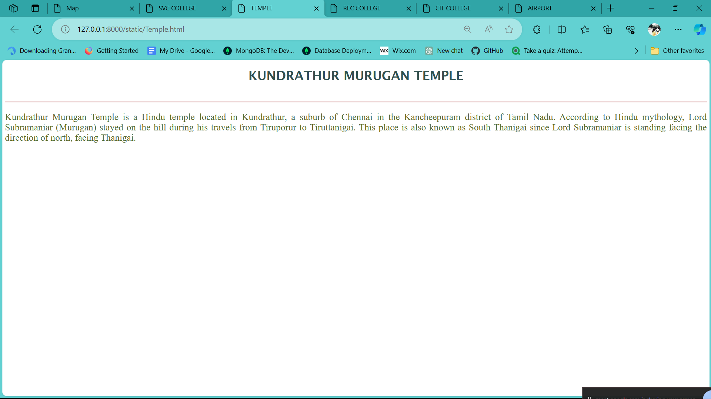
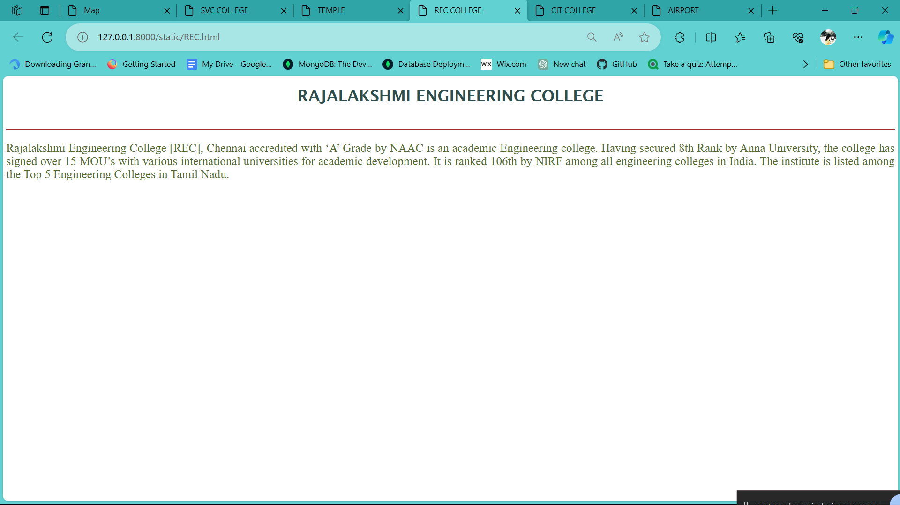
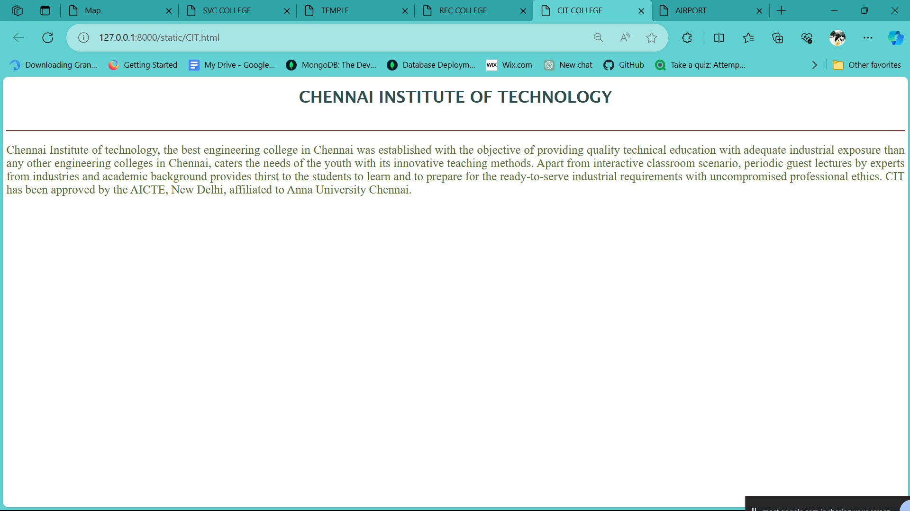
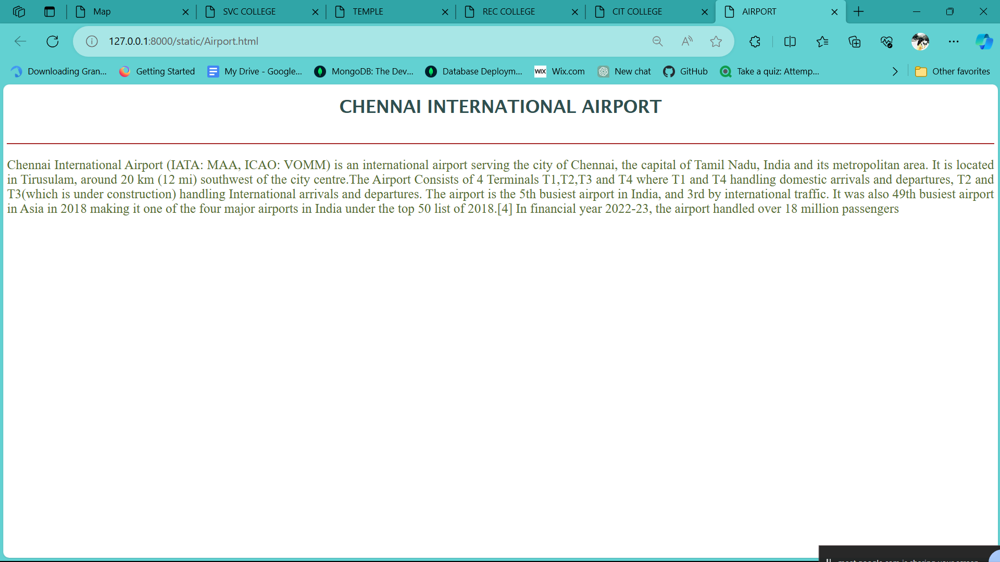

# Ex04 Places Around Me
## DATE:28-10-23
## AIM
To develop a website to display details about the places around my house.

## DESIGN STEPS

### STEP 1
Create a Django admin interface.

### STEP 2
Download your city map from Google.

### STEP 3
Using ```<map>``` tag name the map.

### STEP 4
Create clickable regions in the image using ```<area>``` tag.

### STEP 5
Write HTML programs for all the regions identified.

### STEP 6
Execute the programs and publish them.

## CODE
## index.html
``` html
<!DOCTYPE html>
<html lang="en">
<head>
    <meta charset="UTF-8">
    <meta name="viewport" content="width=device-width, initial-scale=1.0">
    <title>Map</title>
</head>
<body>
    

    <map name="image-map">
        <area target="_blank" alt="CIT COLLEGE" title="CIT COLLEGE" href="CIT.html" coords="764,376,900,480" shape="rect">
        <area target="_blank" alt="SRI VENKATESWARAA COLLEGE" title="SRI VENKATESWARAA COLLEGE" href="SVC.html" coords="355,701,569,795" shape="rect">
        <area target="_blank" alt="CHENNAI INTERNATIONAL AIRPORT" title="CHENNAI INTERNATIONAL AIRPORT" href="Airport.html" coords="1336,236,1484,407" shape="rect">
        <area target="_blank" alt="REC COLLEGE" title="REC COLLEGE" href="REC.html" coords="695,195,890,311" shape="rect">
        <area target="_blank" alt="KUNDRATHUR MURUGAN TEMPLE" title="KUNDRATHUR MURUGAN TEMPLE" href="Temple.html" coords="947,318,1174,394" shape="rect">
    </map>
</body>
</html>

```
<br>

## CIT.html

```html
<!DOCTYPE html>
<html lang="en">
<head>
    <meta charset="UTF-8">
    <meta name="viewport" content="width=device-width, initial-scale=1.0">
    <title>CIT COLLEGE</title>
    <style>
        h1{
            text-align: center;
            font-family: 'Lucida Sans', 'Lucida Sans Regular', 'Lucida Grande', 'Lucida Sans Unicode', Geneva, Verdana, sans-serif;
            color:darkslategray;
        }
        p{
            text-align: justify;
            color:darkolivegreen;
            font-size: x-large;
            
        }
    </style>
</head>
<body>
    <h1>CHENNAI INSTITUTE OF TECHNOLOGY</h1>
    <br>
    <hr color="Brown">
    <p>Chennai Institute of technology, the best engineering college in Chennai was established with the objective of providing quality technical education with adequate industrial exposure than any other engineering colleges in Chennai, caters the needs of the youth with its innovative teaching methods.

        Apart from interactive classroom scenario, periodic guest lectures by experts from industries and academic background provides thirst to the students to learn and to prepare for the ready-to-serve industrial requirements with uncompromised professional ethics.
        
        CIT has been approved by the AICTE, New Delhi, affiliated to Anna University Chennai.</p>

</body>
</html>
```
<br>

## REC.html
```html
<!DOCTYPE html>
<html lang="en">
<head>
    <meta charset="UTF-8">
    <meta name="viewport" content="width=device-width, initial-scale=1.0">
    <title>REC COLLEGE</title>
    <style>
        h1{
            text-align: center;
            font-family: 'Lucida Sans', 'Lucida Sans Regular', 'Lucida Grande', 'Lucida Sans Unicode', Geneva, Verdana, sans-serif;
            color:darkslategray;
        }
        p{
            text-align: justify;
            color:darkolivegreen;
            font-size: x-large;
            
        }
    </style>
</head>
<body>
    <h1>RAJALAKSHMI ENGINEERING COLLEGE</h1>
    <br>
    <hr color="Brown">
    <p>
        Rajalakshmi Engineering College [REC], Chennai accredited with ‘A’ Grade by NAAC is an academic Engineering college. Having secured 8th Rank by Anna University, the college has signed over 15 MOU’s with various international universities for academic development. It is ranked 106th by NIRF among all engineering colleges in India. The institute is listed among the Top 5 Engineering Colleges in Tamil Nadu.</p>

</body>
</html>
```
<br>

## Temple.html
```html
<!DOCTYPE html>
<html lang="en">
<head>
    <meta charset="UTF-8">
    <meta name="viewport" content="width=device-width, initial-scale=1.0">
    <title>TEMPLE</title>
    <style>
        h1{
            text-align: center;
            font-family: 'Lucida Sans', 'Lucida Sans Regular', 'Lucida Grande', 'Lucida Sans Unicode', Geneva, Verdana, sans-serif;
            color:darkslategray;
        }
        p{
            text-align: justify;
            color:darkolivegreen;
            font-size: x-large;
            
        }
    </style>
</head>
<body>
    <h1>KUNDRATHUR MURUGAN TEMPLE</h1>
    <br>
    <hr color="Brown">
    <p>Kundrathur Murugan Temple is a Hindu temple located in Kundrathur, a suburb of Chennai in the Kancheepuram district of Tamil Nadu.

        According to Hindu mythology, Lord Subramaniar (Murugan) stayed on the hill during his travels from Tiruporur to Tiruttanigai. This place is also known as South Thanigai since Lord Subramaniar is standing facing the direction of north, facing Thanigai.
        
</p>

</body>
</html>
```
<br>

## SVC.html
```html
<!DOCTYPE html>
<html lang="en">
<head>
    <meta charset="UTF-8">
    <meta name="viewport" content="width=device-width, initial-scale=1.0">
    <title>SVC COLLEGE</title>
    <style>
        h1{
            text-align: center;
            font-family: 'Lucida Sans', 'Lucida Sans Regular', 'Lucida Grande', 'Lucida Sans Unicode', Geneva, Verdana, sans-serif;
            color:darkslategray;
        }
        p{
            text-align: justify;
            color:darkolivegreen;
            font-size: x-large;
            
        }
    </style>
</head>
<body>
    <h1>SRI VENKATESWARAA COLLEGE</h1>
    <br>
    <hr color="Brown">
    <p>About SVCE!!
        SVCE is a unit of Sri Venkateswara Educational and Health Trust (SVEHT). The Trust was founded on 1 August 1985 at the behest and benign blessings of His Holiness Pujashree Kanchi Kamakoti Peedathipathi Sri Jayendra Saraswathi Swamigal. Dr. A. C. Muthiah, a renowned engineer, industrialist and philanthropist, is the Chairman of the Governing Council of the college. The college is in a 95 acre lush green Campus. It is housed in architecturally exquisite buildings with ample infrastructure such as classrooms, laboratories, libraries, sports arena, canteen, hostels, dispensary, bank etc.,</p>

</body>
</html>
```
<br>

## Airport.html
```html
<!DOCTYPE html>
<html lang="en">
<head>
    <meta charset="UTF-8">
    <meta name="viewport" content="width=device-width, initial-scale=1.0">
    <title>AIRPORT</title>
    <style>
        h1{
            text-align: center;
            font-family: 'Lucida Sans', 'Lucida Sans Regular', 'Lucida Grande', 'Lucida Sans Unicode', Geneva, Verdana, sans-serif;
            color:darkslategray;
        }
        p{
            text-align: justify;
            color:darkolivegreen;
            font-size: x-large;
            
        }
    </style>
</head>
<body>
    <h1>CHENNAI INTERNATIONAL AIRPORT</h1>
    <br>
    <hr color="Brown">
    <p>Chennai International Airport (IATA: MAA, ICAO: VOMM) is an international airport serving the city of Chennai, the capital of Tamil Nadu, India and its metropolitan area. It is located in Tirusulam, around 20 km (12 mi) southwest of the city centre.The Airport Consists of 4 Terminals T1,T2,T3 and T4 where T1 and T4 handling domestic arrivals and departures, T2 and T3(which is under construction) handling International arrivals and departures. The airport is the 5th busiest airport in India, and 3rd by international traffic. It was also 49th busiest airport in Asia in 2018 making it one of the four major airports in India under the top 50 list of 2018.[4] In financial year 2022-23, the airport handled over 18 million passengers</p>

</body>
</html>
```


## OUTPUT









## RESULT
The program for implementing image maps using HTML is executed successfully.
